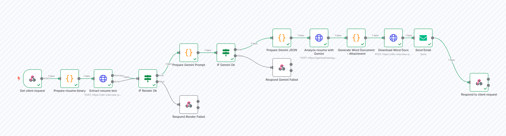
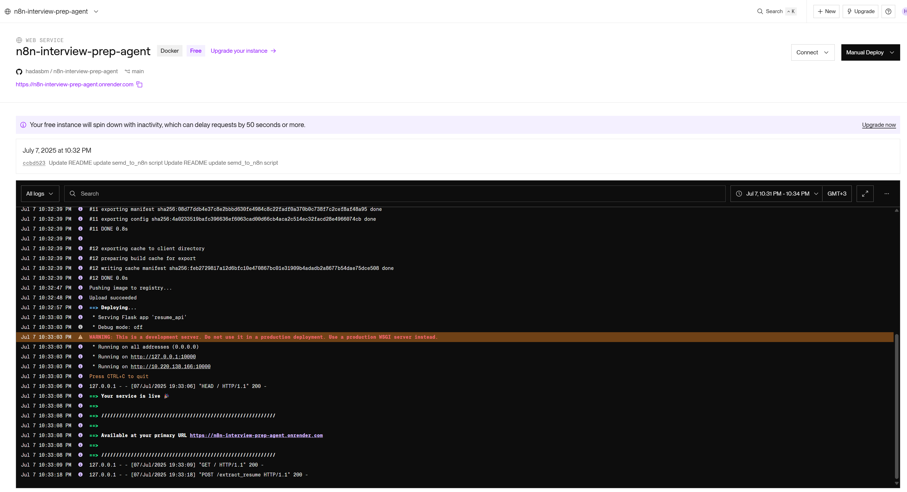

---

# 🎯 Interview Prep Automation

An intelligent automation system that analyzes resumes and generates comprehensive interview preparation documents using AI.


---

## ✨ Features

- 📄 **Resume Analysis**: Extract and analyze text from PDF/DOCX files

- 🤖 **AI-Powered Insights**: Generate detailed feedback using Gemini AI

- 📝 **Interview Questions**: Create 5-7 technical interview questions with answers

- 💼 **Job Matching**: Analyze resume compatibility with job descriptions

- 📧 **Email Delivery**: Automatically send results via email

- 📎 **Downloadable**: DOCX + HTML attachments

-  ✅ Just provide your resume + job info – the agent does the rest!


---

## 🏗️ Architecture

- **n8n**: Workflow automation platform

- **Flask API**: Resume processing and document generation

- **Gemini AI**: Content analysis and generation

- **Docker**: Containerized deployment


---

## 🚀 How to Use

## 🎬 Demo


  



## 🔧 Prerequisites

- Python 3.9+


1. 📥 Clone This Repository

    git clone https://github.com/your-username/interview-prep-agent  
    cd interview-prep-agent

2. ✏️ Edit the Python Client Script

    Open send_to_n8n.py and update the placeholders:

    email = "your@email.com"

    with open(r"<PATH-TO-YOUR-RESUME>", "rb") as file:
        encoded_file = base64.b64encode(file.read()).decode("utf-8")

    data = {
        "email": email,
        "jobLink": "<URL to job posting>",
        "companyLink": "<URL to company site>",
        "linkedinProfile": "<LinkedIn profile URL>",
        "resume": encoded_file,
        "resumeFilename": "MyResume.docx",
        "resumeMimeType": "application/vnd.openxmlformats-officedocument.wordprocessingml.document"
    }

3. ▶️ Run the Script

    python den_to_n8n.py

    Once submitted, you'll receive an email with full analysis + attachments.


---

## 📋 Usage

### 📥 Input Requirements

- **Resume file**: PDF or DOCX format

- **Email address**: To receive results

- **Job link**: URL to job posting

- **Company link (optional)**: Company website

- **LinkedIn profile (optional)**: Your LinkedIn URL


### 📤 Output

**You'll receive an email with**:

- 📊 Detailed resume analysis

- 💡 Improvement recommendations

- ❓ 5–7 technical interview questions with answers

- 🎯 Job matching insights (if job link provided)

- 📎 Complete analysis as a Word document attachment

- 📄 HTML analysis of the resume and job

- 🧩 Categorized insights (skills, tools, company match)


---

## 🧪 Sample Request Structure

{
  "email": "you@example.com",
  "jobLink": "https://company.com/jobs/123",
  "companyLink": "https://company.com",
  "linkedinProfile": "https://linkedin.com/in/yourprofile",
  "resume": "<base64-encoded file>",
  "resumeFilename": "your_cv.docx",
  "resumeMimeType": "application/vnd.openxmlformats-officedocument.wordprocessingml.document"
}


---

## 🛠️ Development

### 🔄 Project Structure
```
interview-prep-automation/
├── README.md
├── Dockerfile                    # n8n container
├── Dockerfile.resume-api        # Flask API container
├── send_to_n8n.py              # Client script (edit + run)
├── resume_api.py                       # Flask API for resume handling (pre-hosted)
├── requirements.txt             # Python dependencies
└── (Optional) local/           # Local-only files (e.g. docker-compose.yml)
```

---

## 🌐 Service Overview

| Service       | Description                          | Hosted At                                         |
|---------------|--------------------------------------|--------------------------------------------------|
| 🧠 Gemini AI  | Resume analysis & content gen.       | Google Gemini API                                |
| 🧰 Flask API  | Extract text, generate DOCX          | Render (hidden – managed by maintainer)          |
| 🔗 Webhook    | Trigger via n8n + validate           | https://hadasbenmoshe.app.n8n.cloud/...          |


---

## 🧠 Keep Render Server Awake

To prevent delays from Render's free-tier server going to sleep, a **secondary n8n workflow** pings the Flask API every 10 minutes. This keeps the service warm and responsive at all times – even without user interaction. No external uptime monitor is needed – it's all handled serverlessly inside n8n.

---

## ⚙️ API Endpoints (For Reference)
The Flask API provides these endpoints:

You don't need to host these – already deployed.

- 'POST /extract_resume': Extracts text from uploaded resume

- 'POST /generate_docx': Generates a formatted Word document

---

## 🔍 Troubleshooting

### Common Issues

**1. Webhook not working**

- Check the webhook URL in send_to_n8n.py

- Ensure n8n workflow is activated

- Verify webhook ID matches


**2. File processing errors**

- Ensure resume is in PDF or DOCX format

- Check file size limits

- Verify file is not corrupted


---

## 📣 Want to Share?

After running successfully, feel free to share your results or write your own post!
This agent is especially helpful for:

🎯 Career changers

📈 Tech professionals prepping for interviews

🧪 Analyzing job fit based on actual roles


---

## 📄 License

This project is licensed under the MIT License - see the [LICENSE](LICENSE) file for details.


---

## 🙏 Acknowledgments

- [n8n](https://n8n.io/) for workflow automation

- [Google Gemini](https://ai.google.dev/) for AI capabilities

- [python-docx](https://python-docx.readthedocs.io/) for document generation


---

**Made with ❤️ to help you shine in your next interview**

---